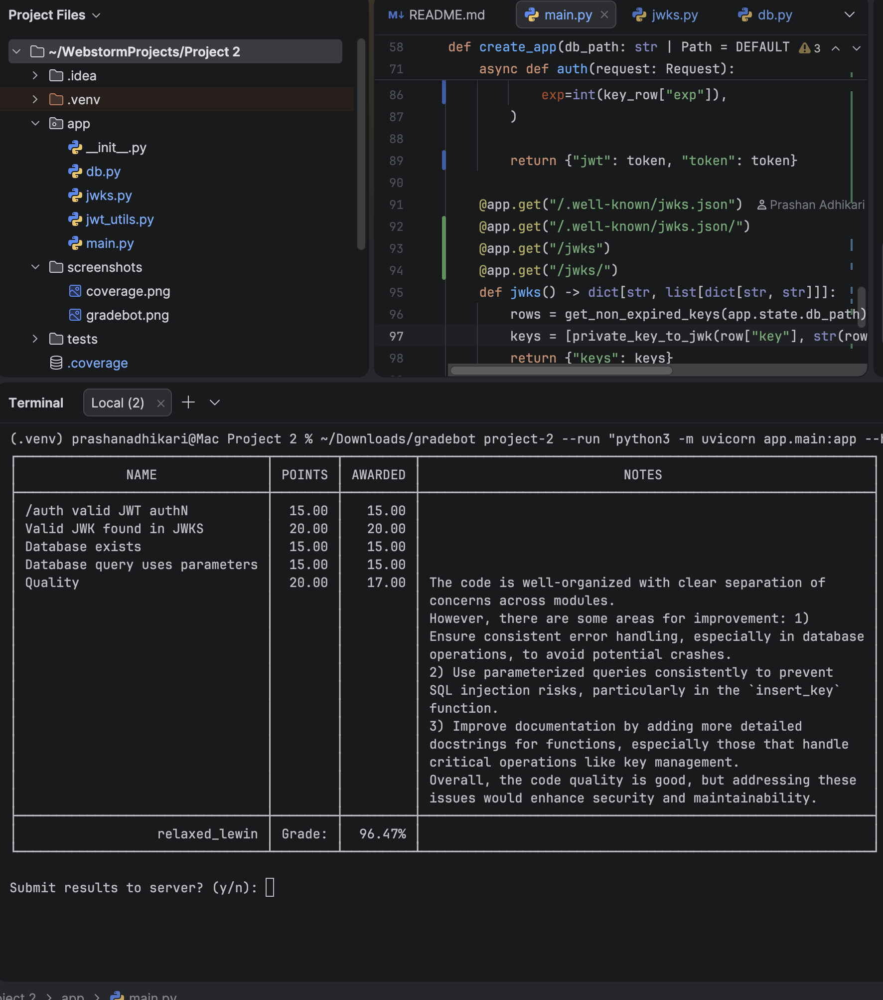

# JWKS Server

This project is a FastAPI service that generates RSA signing keys, stores them in SQLite, exposes a JSON Web Key Set (JWKS), and issues RS256-signed JWTs for testing.

## Features

- Generates 2048-bit RSA private keys for JWT signing
- Stores key material and expiration timestamps in SQLite
- Keeps at least one valid key and one expired key available
- Publishes only non-expired public keys through a JWKS endpoint
- Issues JWTs signed with either a valid key or an expired key for testing scenarios
- Accepts mock credentials in JSON or Basic Auth format without enforcing authentication

## Project Structure

```text
app/
  db.py         SQLite schema, key seeding, and key lookup helpers
  jwks.py       RSA key generation and JWK conversion
  jwt_utils.py  JWT signing helpers
  main.py       FastAPI app and routes
tests/
  test_server.py
screenshots/
  coverage.png
  gradebot.png
```

## Requirements

- Python 3.10+
- `pip`

## Installation

```bash
python3 -m venv .venv
source .venv/bin/activate
pip install -r requirements.txt
```

## Running the Server

```bash
uvicorn app.main:app --reload
```

The app initializes its SQLite database automatically on startup and creates any missing valid or expired signing keys.

Default database file:

```text
totally_not_my_privateKeys.db
```

## API Endpoints

### `POST /auth`

Returns a signed JWT using a non-expired RSA key.

Example response:

```json
{
  "jwt": "<token>",
  "token": "<token>"
}
```

Optional behaviors:

- Send JSON like `{"username":"userABC","password":"password123"}`.
- Send a Basic Auth header.
- Add `?expired=true` to sign with an expired key instead.

Example requests:

```bash
curl -X POST http://127.0.0.1:8000/auth
curl -X POST "http://127.0.0.1:8000/auth?expired=true"
curl -X POST http://127.0.0.1:8000/auth \
  -H "Content-Type: application/json" \
  -d '{"username":"userABC","password":"password123"}'
```

### `GET /.well-known/jwks.json`

Returns the public JWKS document for non-expired signing keys.

Aliases:

- `GET /jwks`

Example response shape:

```json
{
  "keys": [
    {
      "kty": "RSA",
      "use": "sig",
      "alg": "RS256",
      "kid": "1",
      "n": "...",
      "e": "AQAB"
    }
  ]
}
```

## Running Tests

```bash
PYTHONPATH=. pytest
```

The test suite covers:

- JWT issuance
- JSON and Basic Auth request handling
- Expired-key signing behavior
- JWKS publishing behavior
- JWT verification with the published public key
- SQLite key storage compatibility for text and blob formats

## Screenshots

### Test Coverage


### Gradebot Results



## Notes

Gradebot reports a `401 Unauthorized` in its quality section, but the core endpoint and signing checks pass.
